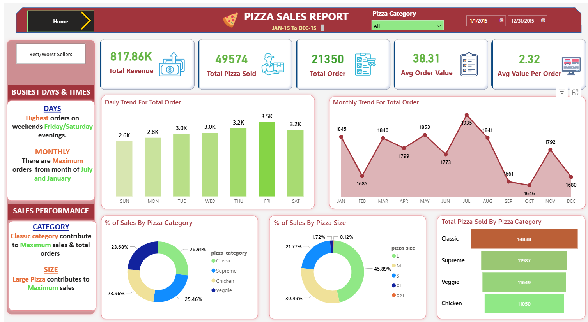
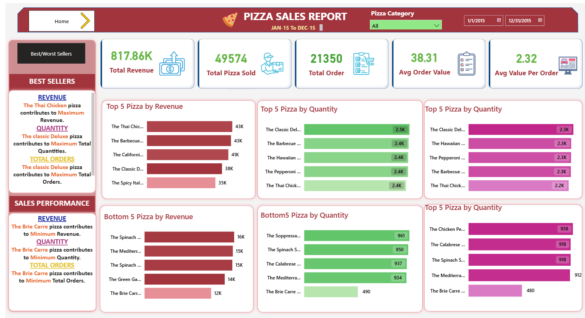

# 🍕 Pizza Sales Analysis – SQL + Power BI Dashboard  

🚀 **Data-driven insights** into pizza sales using SQL & Power BI – uncovering trends, top performers, and revenue drivers to help optimize business decisions.  

---
## 📂 Dataset  

The dataset used in this project contains detailed **pizza sales records** including:  

- 🆔 **Order ID** – Unique identifier for each order  
- 📅 **Order Date** – Date when the order was placed  
- ⏰ **Order Time** – Time of the order (used for hourly trends)  
- 🍕 **Pizza Name** – Full name of the pizza ordered  
- 🏷️ **Pizza Category** – Category (Classic, Supreme, Chicken, Veggie)  
- 📏 **Pizza Size** – Size (S, M, L, XL, XXL)  
- 🔢 **Quantity** – Number of pizzas in the order  
- 💰 **Total Price** – Total price for that line item  

📥 **Download Dataset:** [pizza_sales.xlsx](Data/Pizza_Sales.xlsx)  
> *(Click to view or download the raw dataset directly from this repository.)*

## 📊 **Project Overview**  
This project explores **pizza sales data** using SQL for data extraction and Power BI for visualization.  
The dashboard highlights **revenue trends, best/worst sellers, and sales distribution by category & size**.

---

## 🛠️ **Tech Stack**
- 🗄 **SQL** – KPI calculations, trend analysis  
- 📊 **Power BI** – Interactive dashboard creation and Used DAX for Measures/Calculated columns
- 📂 **Dataset** – Pizza sales (orders, categories, quantities, prices)

---

## 🧮 **Key SQL Queries**

🔑 **KPI Metrics**
```sql
-- Total Revenue
SELECT SUM(total_price) AS Total_Revenue FROM pizza_sales;

-- Average Order Value
SELECT (SUM(total_price) / COUNT(DISTINCT order_id)) AS Avg_order_Value
FROM pizza_sales;

-- Total Pizzas Sold
SELECT SUM(quantity) AS Total_pizza_sold FROM pizza_sales
```
## 📅 Trends & Distribution
```sql
-- Daily Trend
SELECT DATENAME(DW, order_date) AS order_day, COUNT(DISTINCT order_id) AS total_orders
FROM pizza_sales
GROUP BY DATENAME(DW, order_date);

-- % Sales by Pizza Category
SELECT pizza_category, CAST(SUM(total_price) AS DECIMAL(10,2)) as total_revenue,
CAST(SUM(total_price) * 100 / (SELECT SUM(total_price) from pizza_sales) AS DECIMAL(10,2)) AS PCT
FROM pizza_sales
GROUP BY pizza_category;
```
## 🏆 Best & Worst Sellers
```sql
-- Top 5 Sellers
SELECT TOP 5 pizza_name, SUM(quantity) AS Total_Pizza_Sold
FROM pizza_sales
GROUP BY pizza_name
ORDER BY Total_Pizza_Sold DESC;

-- Bottom 5 Sellers
SELECT TOP 5 pizza_name, SUM(quantity) AS Total_Pizza_Sold
FROM pizza_sales
GROUP BY pizza_name
ORDER BY Total_Pizza_Sold ASC;
```
## 📈 Dashboard Highlights
| 📌 Metric                | 📊 Value  |
| ------------------------ | --------- |
| 💰 **Total Revenue**     | `817.86K` |
| 🍕 **Total Pizzas Sold** | `49,574`  |
| 🛒 **Total Orders**      | `21,350`  |
| 📦 **Avg Order Value**   | `38.31`   |
| 🔢 **Avg Pizzas/Order**  | `2.32`    |

## 🕑 Busiest Days & Times

✅ Friday & Saturday evenings see the highest order volume
📅 Peak Months: July and January

## 🏆 Best/Worst Performers

**🥇 Top Pizza by Revenue:** Thai Chicken

**🥇 Top Pizza by Quantity & Orders:** Classic Deluxe

**🥀 Lowest Sales:** Brie Carre

## 📊 Sales Distribution

**Category:** 🏆 Classic category leads in revenue & orders

**Size:** 🍕 Large pizza = 45.89% of sales

## 💡 Key Insights & Recommendations

**📌 Stock More Large Pizzas –** They contribute to maximum sales

**📌 Focus Promotions on Weekends –** Highest order volume occurs Friday & Saturday evenings

**📌 Push Underperforming Pizzas –** Consider discounts for Brie Carre & Mediterranean pizzas

**📌 Leverage July & January Demand –** Plan marketing campaigns during these months

## 🚀 How to Use

Clone this repository

Run SQL queries from [PIZZA_SQL_QUERIES.sql](Document/PIZZA_SQL_QUERIES.pdf) on your database

Open .pbix file in Power BI to explore the dashboard interactively

## 🖼 Dashboard Preview

**[View Interactive Dashboard](https://app.powerbi.com/view?r=eyJrIjoiZTY2Y2ViY2MtNzkyZC00ZTUwLThjNmItYTg0MzU3NjlmOTQ2IiwidCI6IjY0YjkzNTFmLTMzZGYtNDAyNy1iNTNiLThiNDEyYjdmYmU5NCJ9)**


### Overview Page



### Best/Worst Sellers Page


